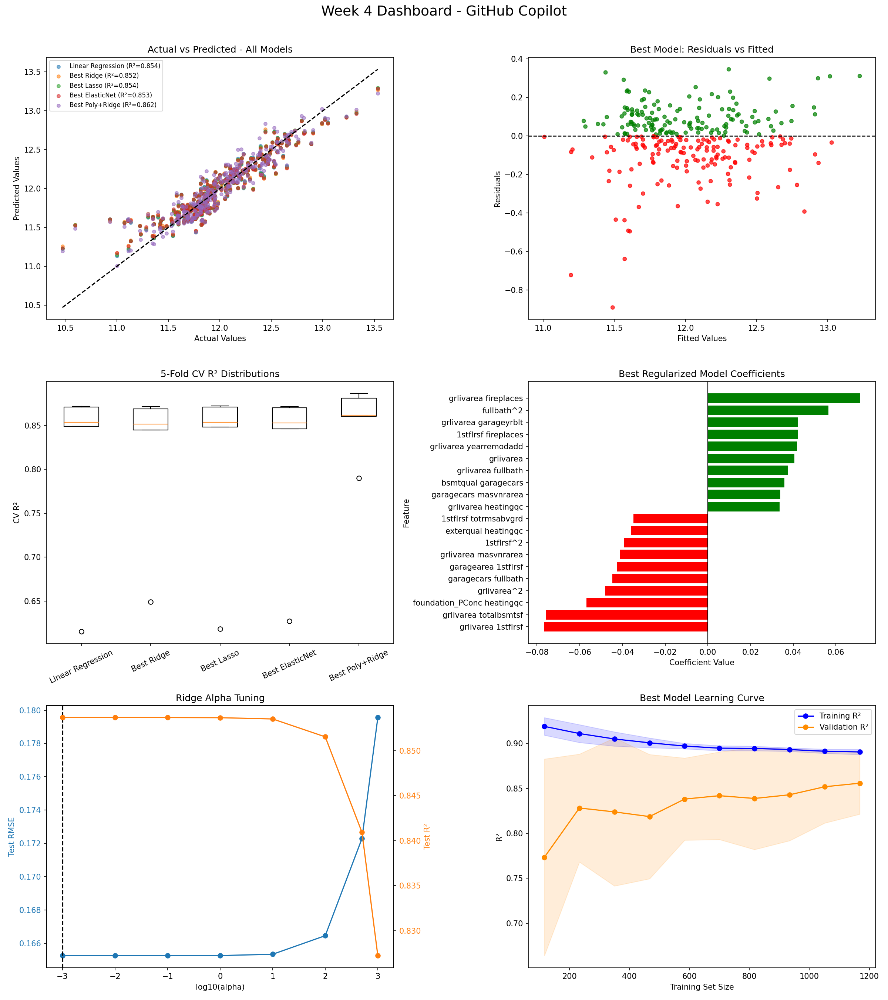

# House Prices Regression Project

## Project Overview
This project builds and compares several regression models for the House Prices dataset. The workflow starts with preprocessing, feature engineering, and target transformation, then evaluates multiple linear and regularized regression approaches before selecting the best final model.

## Dataset
The project uses the Kaggle House Prices data stored in this folder:
- `train.csv`
- `test.csv`
- `sample_submission.csv`

The target variable is `SalePrice`. The notebook standardizes column names, fills missing values, encodes ordinal and categorical features, applies a frequency encoding for `Neighborhood`, and uses `np.log1p()` on the target to reduce skew.

## Workflow Summary
1. Load and clean the training data.
2. Encode ordinal and categorical variables.
3. Select the 20 strongest features by correlation with `SalePrice`.
4. Split the data into train and test sets.
5. Scale the features with `StandardScaler`.
6. Train and compare five regression models.
7. Run diagnostics, cross-validation, learning curves, and coefficient-path analysis.
8. Save the best model and generate a dashboard.

## Models Trained
Five models were trained and compared:
- Linear Regression
- Ridge Regression
- Lasso Regression
- ElasticNet Regression
- Polynomial + Ridge Pipeline

## Results
The best model was the **Polynomial + Ridge Pipeline**.

- Test R²: **0.8616**
- Test RMSE: **$30,823**
- Log-scale RMSE: **0.1607**

The model performed best because it captured a small amount of useful nonlinearity while Ridge regularization kept the polynomial feature space under control. The simpler linear models performed well, but they did not beat the final combined pipeline.

## Files In This Folder
- `week3_house_prices_pipeline.ipynb` - main analysis notebook
- `week4_dashboard.png` - final visualization dashboard
- `week4_best_model.pkl` - saved best model pipeline
- `README.md` - project summary and instructions
- `train.csv` - training data
- `test.csv` - test data
- `sample_submission.csv` - submission template

## Tools Used
- Python
- Jupyter Notebook
- pandas
- numpy
- scikit-learn
- matplotlib
- seaborn
- joblib

## How To Run
1. Open `week3_house_prices_pipeline.ipynb` in Jupyter Notebook or VS Code.
2. Run the cells from top to bottom.
3. Make sure the notebook is in the same folder as the CSV files.
4. The best model and dashboard will be generated automatically.

## Dashboard Screenshot

## Notes
- The target is modeled on the log scale for better stability.
- The final dashboard includes actual-vs-predicted plots, residual diagnostics, cross-validation summaries, coefficient paths, and prediction error analysis.
- The saved model can be reused for inference with `joblib.load("week4_best_model.pkl")`.
